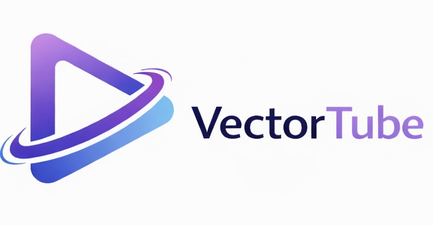
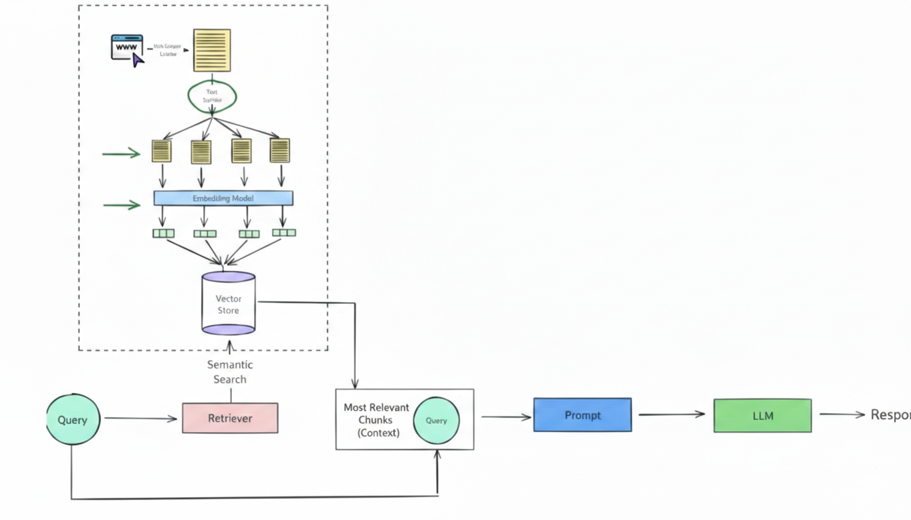
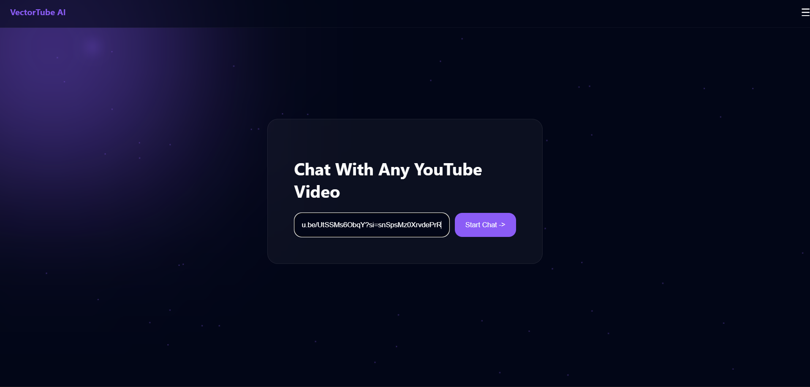
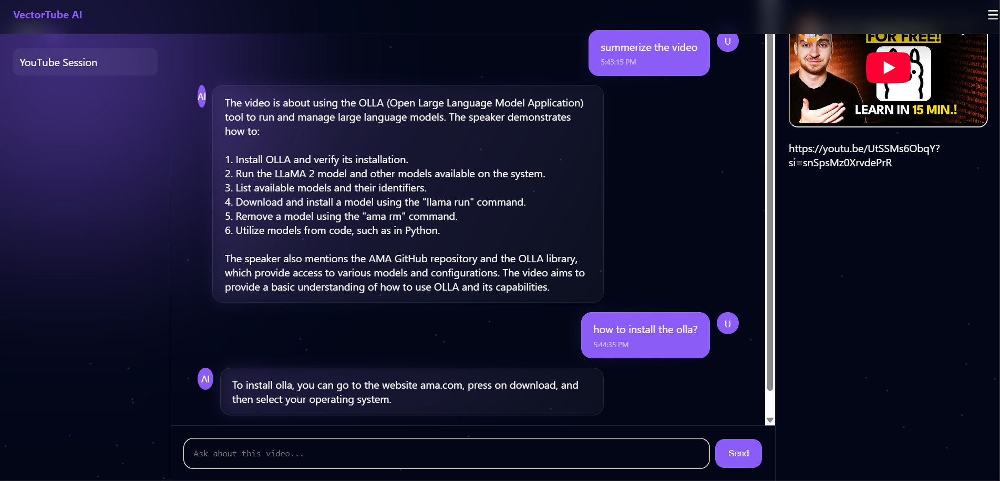

# 🎥 VectorTube

<p align="center">
  
</p>

<h3 align="center">
AI Video Intelligence Platform
</h3>

<p align="center">
Built by <b>Codify</b>
</p>

<p align="center">
  
  
  
  
</p>

---

## ⚡ Overview

**VectorTube** is an AI-native video intelligence platform developed by **Codify**.

It transforms YouTube content into interactive knowledge by combining transcript processing, semantic search, and Retrieval-Augmented Generation (RAG).  
Instead of watching long videos, users can directly interact with the information inside them.

This repository contains the core system powering the VectorTube product.

---

## 🔥 What Makes It Different

- Transcript-first AI reasoning
- Context-aware retrieval pipeline
- Lightweight RAG architecture
- Fast web-based interface
- Product-focused AI design

---

## 🧠 System Flow

1. Extract transcript from video  
2. Split into semantic chunks  
3. Generate embeddings  
4. Store vectors  
5. Retrieve relevant context  
6. Send context to LLM  
7. Generate grounded responses  

---

## 🏗 Architecture

<p align="center">
  
</p>

---

## 🎨 Product Preview

<p align="center">
  
  
</p>

---

## 📂 Repository Structure

```bash
VectorTube/
│
├── app.py
├── rag/
│   ├── loader.py
│   ├── embeddings.py
│   ├── retriever.py
│   └── chain.py
│
├── templates/
├── static/
└── screenshots/
```

---

## ▶ Run Locally

```bash
python app.py
```

---

## 🧩 Technology

Python • LangChain • Vector Databases • Flask • LLM APIs

---

## 🏢 Codify

Codify is an AI Product Studio focused on building intelligent software platforms, AI-native tools, and next-generation digital systems.

VectorTube is an official Codify product.

---

## 📌 Status

Active Development — Early Product Release
